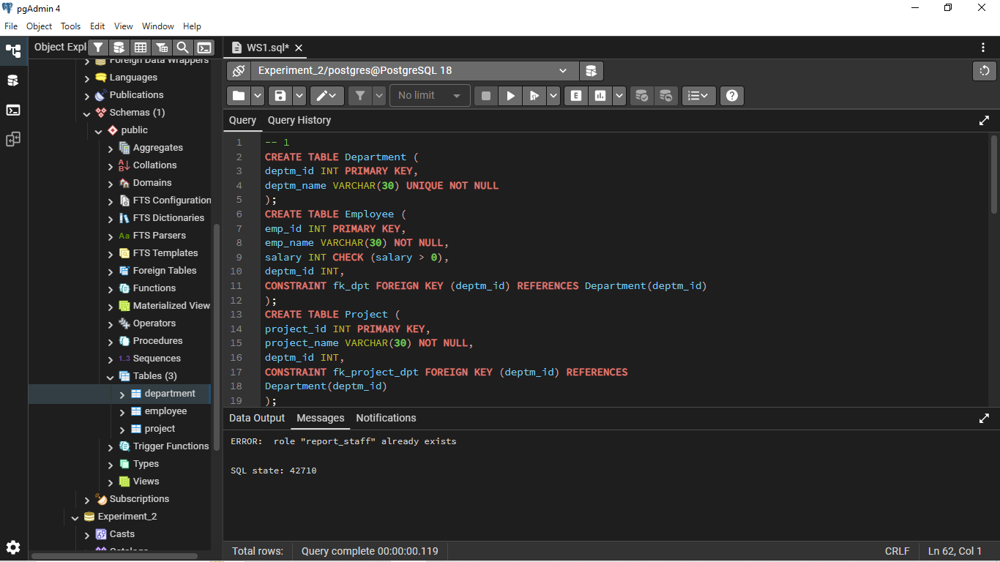

# Worksheet 1.1 – Database Design, Manipulation & Access Control

**Student Name:** Sanchit Katoch  
**UID:** 25MCA20059  
**Branch:** MCA  
**Section/Group:** 25MCA-1-A  
**Semester:** 2nd  
**Date of Performance:** 06/01/2026  
**Subject Name:** Technical Training I  
**Subject Code:** 25CAP-652

---

## Aim / Overview

The aim of this practical is to design and implement a sample database system using **DDL**, **DML**, and **DCL** commands. The database ensures **data integrity**, **secure role-based access**, and proper **schema management** using PostgreSQL.

The system manages three core entities:

* Departments
* Employees
* Projects

---

## Objective

* To gain hands-on experience with **Data Definition Language (DDL)** commands.
* To perform **Data Manipulation Language (DML)** operations such as INSERT, UPDATE, and DELETE.
* To implement **Data Control Language (DCL)** commands for role-based security.
* To ensure read-only access for authorized users using GRANT and REVOKE.

---

## Software Requirements

* **Oracle Database Express Edition**
* **PostgreSQL with pgAdmin**

---

## Database Design

### Tables Created

1. **Department**

   * Primary Key: `deptm_id`
   * Constraints: `PRIMARY KEY`, `UNIQUE`, `NOT NULL`

2. **Employee**

   * Primary Key: `emp_id`
   * Foreign Key: `deptm_id` references Department
   * Constraints: `CHECK`, `NOT NULL`

3. **Project**

   * Primary Key: `project_id`
   * Foreign Key: `deptm_id` references Department

---

## Operations Performed

### 1. DDL Operations

* Created tables using `CREATE TABLE`
* Applied primary key, foreign key, and check constraints
* Modified table structure using `ALTER TABLE`
* Removed unused table using `DROP TABLE`

### 2. DML Operations

* Inserted sample records using `INSERT`
* Updated employee salary using `UPDATE`
* Deleted project records using `DELETE` while maintaining referential integrity

### 3. DCL Operations (Access Control)

* Checked active user using `SELECT CURRENT_USER`
* Created a reporting role (`report_staff`) with login access
* Granted **ONLY SELECT** privileges on all tables
* Revoked `INSERT`, `UPDATE`, `DELETE`, and `CREATE` privileges
* Ensured complete **read-only access** for reporting staff

---

## Security Implementation

* Role-based access control implemented using `GRANT` and `REVOKE`
* Reporting staff can only view data
* Schema modification and data manipulation are restricted

---

## Verification

* Logged in using `report_staff` role
* Verified that only SELECT queries are allowed
* Confirmed that CREATE, INSERT, UPDATE, and DELETE operations are blocked

---

## Output Summary

* Department Table:
* Employee Table:
* Project Table:
* Current User:
* Read-only Access:

---

## Learning Outcomes

* Created a database and tables with constraints
* Inserted, queried, updated, and deleted data
* Modified table structure dynamically
* Implemented role-based security using GRANT and REVOKE
* Verified privileges using PostgreSQL system queries
* Understood the practical usage of:

  * **DDL:** CREATE, ALTER, DROP
  * **DML:** INSERT, UPDATE, DELETE
  * **DCL:** GRANT, REVOKE
  * **SELECT** queries

