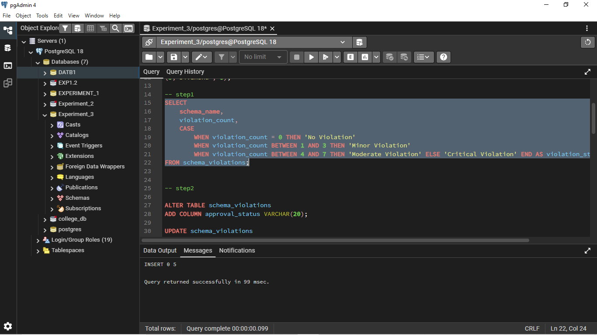
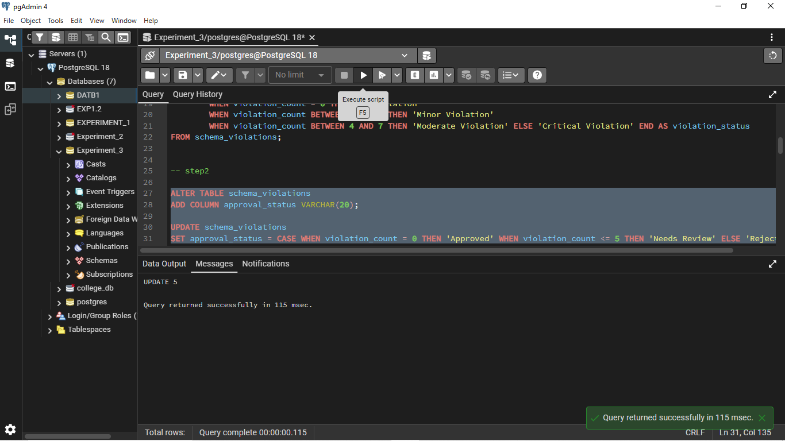
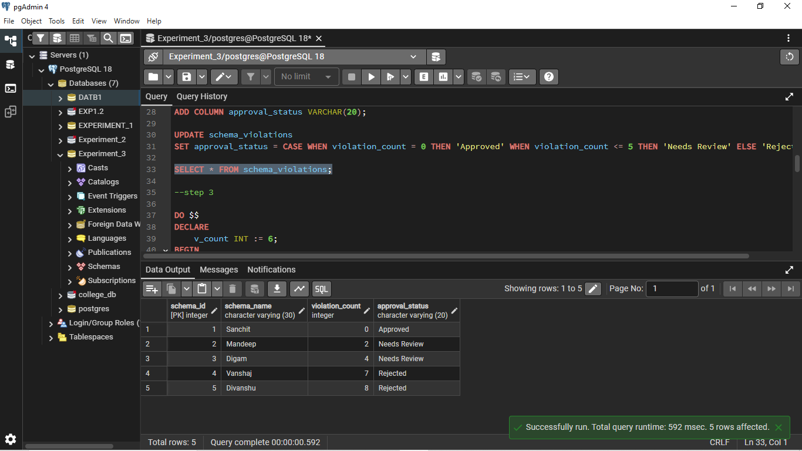
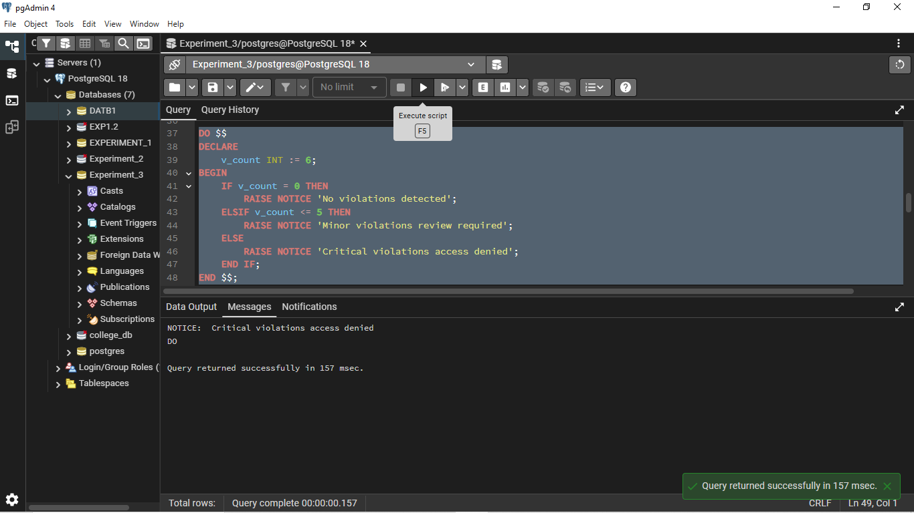
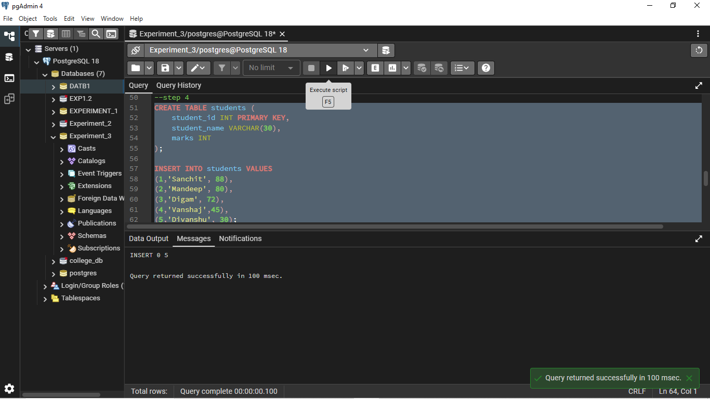

# Worksheet – 3 : Conditional Logic in PostgreSQL

**Student Name:** Sanchit Katoch  
**UID:** 25MCA20059  
**Branch:** MCA  
**Section/Group:** 25MCA-1-A  
**Semester:** 2nd  
**Date of Performance:** 27/01/2026  
**Subject Name:** Technical Training I  
**Subject Code:** 25CAP-652

---

## 1. Aim / Overview

The aim of this practical is to implement **conditional decision-making logic** in PostgreSQL using **CASE expressions** and **IF–ELSE constructs**. The experiment demonstrates how rule-based logic can be applied for **classification, validation, grading, and priority-based processing**, which are commonly used in real-world database systems.

---

## 2. Objectives

* To understand conditional execution in SQL
* To implement decision-making logic using CASE expressions
* To simulate real-world rule validation scenarios
* To classify data based on multiple conditions
* To strengthen SQL logic skills required in interviews and back-end systems

---

## 3. Software Requirements

* PostgreSQL (via pgAdmin)
* Oracle Database Express Edition (as per syllabus reference)

---

## 4. Procedure

### Step 0: Environment Setup

* Start PostgreSQL server
* Open pgAdmin and connect to the database

### Step 1: Table Creation and Data Insertion

A table is created to store schema/entity details along with violation counts. Multiple records are inserted with varying violation values.

### Step 2: Classification Using CASE Expression

* Retrieve schema names and violation counts
* Use CASE logic to classify records into:

  * No Violation
  * Minor Violation
  * Moderate Violation
  * Critical Violation

### Step 3: CASE Logic in UPDATE Statement

* Add a new column `approval_status`
* Update approval status based on violation count using conditional rules such as:

  * Approved
  * Needs Review
  * Rejected

### Step 4: IF–ELSE Logic Using PL/pgSQL

* Use a procedural DO block
* Declare a variable representing violation count
* Display different messages using IF–ELSE conditions

### Step 5: Real-World Classification Scenario (Grading System)

* Create a students table
* Assign grades to students based on marks using CASE expressions

### Step 6: Custom Sorting Using CASE

* Retrieve schema details
* Apply priority-based sorting using CASE in ORDER BY clause

---

## 5. SQL Code Implementation

### Table Creation and Data Insertion

```sql
CREATE TABLE schema_violations (
    schema_id INT PRIMARY KEY,
    schema_name VARCHAR(30),
    violation_count INT
);

INSERT INTO schema_violations VALUES
(1,'Sanchit', 0),
(2,'Mandeep', 2),
(3,'Digam', 4),
(4,'Vanshaj', 7),
(5,'Divanshu', 8);
```

---

### Step 1: Classification Using CASE

```sql
SELECT
    schema_name,
    violation_count,
    CASE
        WHEN violation_count = 0 THEN 'No Violation'
        WHEN violation_count BETWEEN 1 AND 3 THEN 'Minor Violation'
        WHEN violation_count BETWEEN 4 AND 7 THEN 'Moderate Violation'
        ELSE 'Critical Violation'
    END AS violation_status
FROM schema_violations;
```

---

### Step 2: CASE Logic in UPDATE

```sql
ALTER TABLE schema_violations
ADD COLUMN approval_status VARCHAR(20);

UPDATE schema_violations
SET approval_status = CASE
    WHEN violation_count = 0 THEN 'Approved'
    WHEN violation_count <= 5 THEN 'Needs Review'
    ELSE 'Rejected'
END;
```

---

### Step 3: IF–ELSE Using PL/pgSQL

```sql
DO $$
DECLARE
    v_count INT := 6;
BEGIN
    IF v_count = 0 THEN
        RAISE NOTICE 'No violations detected';
    ELSIF v_count <= 5 THEN
        RAISE NOTICE 'Minor violations review required';
    ELSE
        RAISE NOTICE 'Critical violations access denied';
    END IF;
END $$;
```

---

### Step 4: Student Grading System

```sql
CREATE TABLE students (
    student_id INT PRIMARY KEY,
    student_name VARCHAR(30),
    marks INT
);

INSERT INTO students VALUES
(1,'Sanchit', 88),
(2,'Mandeep', 80),
(3,'Digam', 72),
(4,'Vanshaj',45),
(5,'Divanshu', 30);

SELECT student_name, marks,
    CASE
        WHEN marks >= 80 THEN 'A'
        WHEN marks >= 70 THEN 'B'
        WHEN marks >= 60 THEN 'C'
        WHEN marks >= 40 THEN 'D'
        ELSE 'F'
    END AS grade
FROM students;
```

---

### Step 5: Custom Sorting Using CASE

```sql
SELECT schema_name, violation_count
FROM schema_violations
ORDER BY CASE
    WHEN violation_count = 0 THEN 1
    WHEN violation_count <= 3 THEN 2
    WHEN violation_count <= 7 THEN 3
    ELSE 4
END;
```


## Output

### Prerequisite: Schema Violation Table Creation
The schema violation table was successfully created and populated with sample data.


---

### Step 1: Violation Classification Using CASE




---

### Step 2: Conditional Approval Status Update




---

### Step 3: IF-ELSE Logic Using PL/pgSQL
Conditional messages were displayed correctly using IF–ELSE logic in a PL/pgSQL block.



---

### Step 4: Student Grading System
Students were classified into grades correctly based on their marks.



---

### Step 5: Priority-Based Sorting Using CASE
Schema records were sorted according to violation severity using custom CASE-based ordering.


---

## 7. Learning Outcomes

* Understood how conditional logic is implemented in PostgreSQL using CASE expressions and IF–ELSE constructs
* Learned how rule-based SQL logic helps in data classification and validation
* Gained the ability to apply conditional statements in SELECT, UPDATE, and procedural blocks
* Developed clarity in using CASE-based logic for analytics, grading, and compliance reporting scenarios

---


