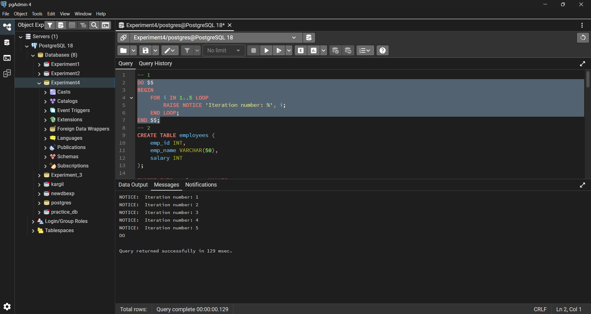
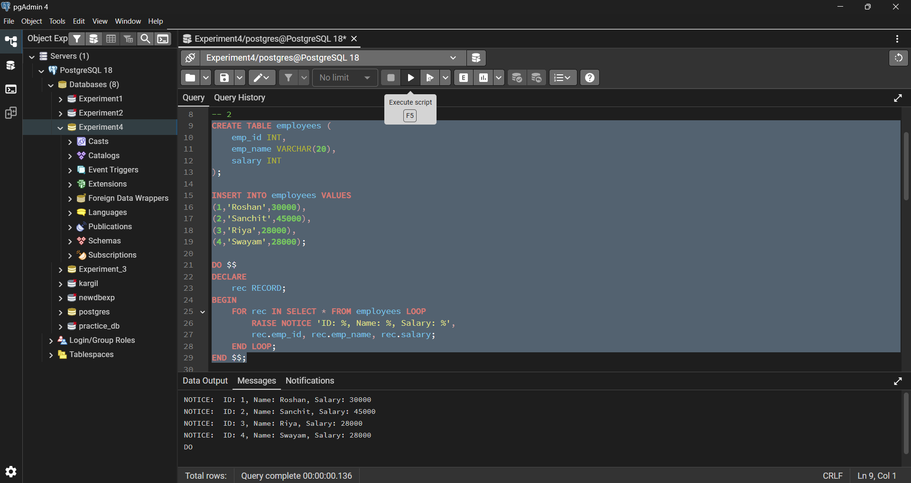
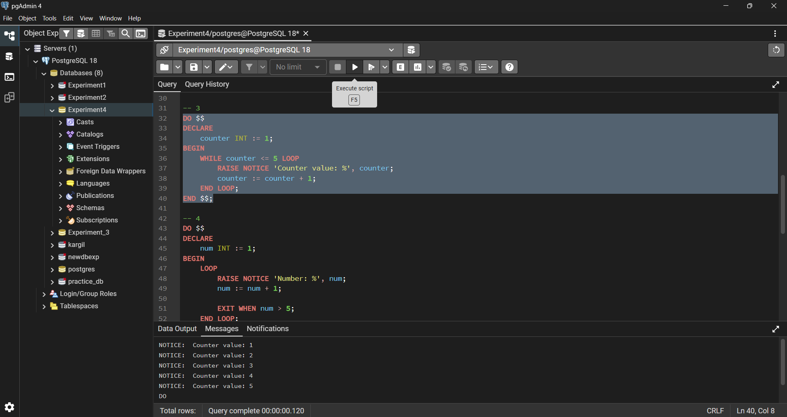
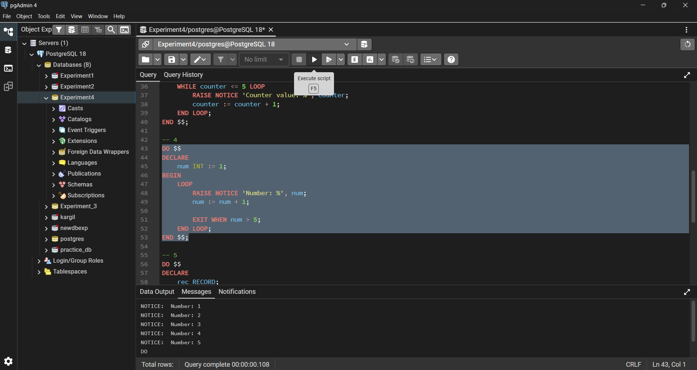
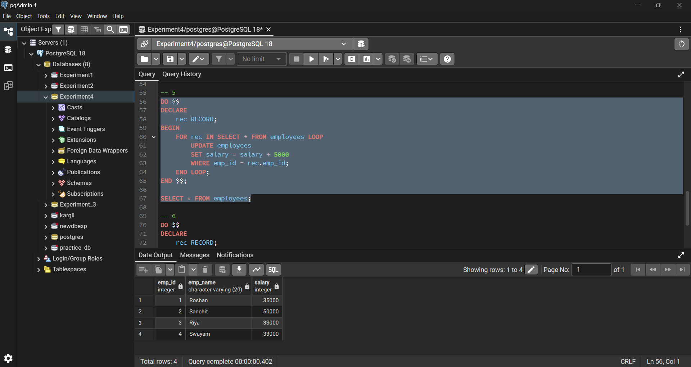
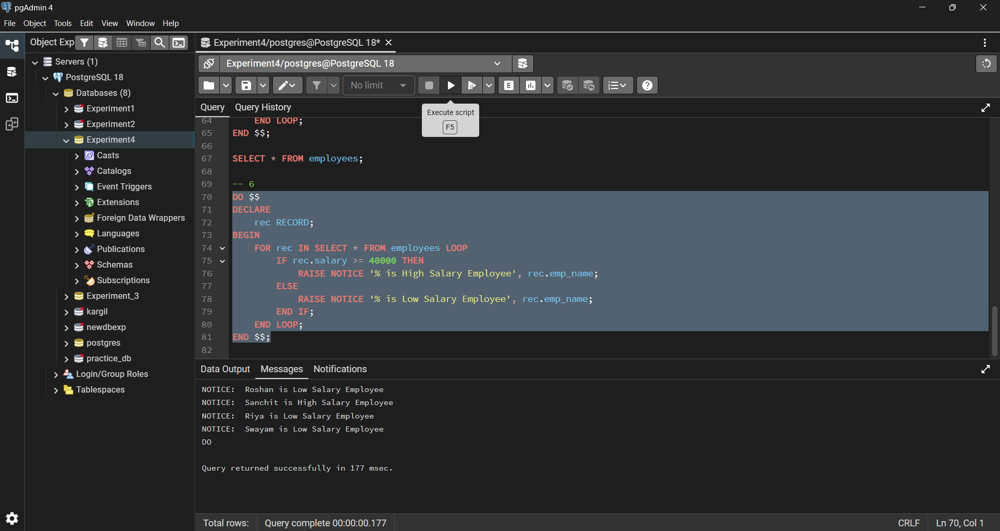

# Experiment No. 4

## Student Information

* **Name:** Sanchit Katoch
* **UID:** 25MCA20059
* **Branch:** MCA – General
* **Section/Group:** 25MCA-1-A
* **Semester:** 2nd
* **Subject:** Technical Training–1
* **Subject Code:** 25CAP-652
* **Date of Performance:** 03/02/26

---

## Aim

To understand and implement iterative control structures in PostgreSQL conceptually, including **FOR loops**, **WHILE loops**, and **basic LOOP constructs**, for repeated execution of database logic.

---

## Objectives

* To understand why iteration is required in database programming.
* To learn the purpose and behaviour of **FOR**, **WHILE**, and **LOOP** constructs.
* To understand how repeated data processing is handled in databases.
* To relate loop concepts to real-world batch processing scenarios.
* To strengthen conceptual knowledge of procedural SQL used in enterprise systems.

---

## Tools Used

* **PostgreSQL**

---

## Procedure

### Step 1: FOR Loop – Simple Iteration

* The loop runs a fixed number of times.
* Each iteration represents one execution cycle.
* Useful for understanding basic loop behaviour.

### Step 2: FOR Loop with Query (Row-by-Row Processing)

* The loop processes database records one at a time.
* Each iteration handles a single row.
* Simulates cursor-based processing.

### Step 3: WHILE Loop – Conditional Iteration

* The loop runs until a condition becomes false.
* Execution depends entirely on the condition.
* The condition is checked before every iteration.

### Step 4: LOOP with EXIT WHEN

* The loop does not stop automatically.
* An explicit exit condition controls termination.
* Provides flexibility for complex logic.

### Step 5: Salary Increment Using FOR Loop

* Employee records are processed one by one.
* Salary values are updated iteratively.
* Represents real-world payroll processing.

### Step 6: Combining LOOP with IF Condition

* Loop processes each record.
* Conditional logic classifies data during iteration.
* Demonstrates decision-making inside loops.

---

## Code Implementation

### 1. FOR Loop – Simple Iteration

```sql
DO $$
BEGIN
    FOR i IN 1..5 LOOP
        RAISE NOTICE 'Iteration number: %', i;
    END LOOP;
END $$;
```

### 2. FOR Loop with Query (Row-by-Row Processing)

```sql
CREATE TABLE employees (
    emp_id INT,
    emp_name VARCHAR(50),
    salary INT
);

INSERT INTO employees VALUES
(1, 'Amit', 30000),
(2, 'Neha', 45000),
(3, 'Rahul', 28000);

DO $$
DECLARE
    rec RECORD;
BEGIN
    FOR rec IN SELECT * FROM employees LOOP
        RAISE NOTICE 'ID: %, Name: %, Salary: %',
        rec.emp_id, rec.emp_name, rec.salary;
    END LOOP;
END $$;
```

### 3. WHILE Loop – Conditional Iteration

```sql
DO $$
DECLARE
    counter INT := 1;
BEGIN
    WHILE counter <= 5 LOOP
        RAISE NOTICE 'Counter value: %', counter;
        counter := counter + 1;
    END LOOP;
END $$;
```

### 4. LOOP with EXIT WHEN

```sql
DO $$
DECLARE
    num INT := 1;
BEGIN
    LOOP
        RAISE NOTICE 'Number: %', num;
        num := num + 1;
        EXIT WHEN num > 5;
    END LOOP;
END $$;
```

### 5. Salary Increment Using FOR Loop

```sql
DO $$
DECLARE
    rec RECORD;
BEGIN
    FOR rec IN SELECT * FROM employees LOOP
        UPDATE employees
        SET salary = salary + 5000
        WHERE emp_id = rec.emp_id;
    END LOOP;
END $$;

SELECT * FROM employees;
```

### 6. Combining LOOP with IF Condition

```sql
DO $$
DECLARE
    rec RECORD;
BEGIN
    FOR rec IN SELECT * FROM employees LOOP
        IF rec.salary >= 40000 THEN
            RAISE NOTICE '% is High Salary Employee', rec.emp_name;
        ELSE
            RAISE NOTICE '% is Low Salary Employee', rec.emp_name;
        END IF;
    END LOOP;
END $$;
```

---

## Output

### Step 1: FOR Loop – Simple Iteration

Displays iteration numbers from 1 to 5.


### Step 2: FOR Loop with Query

Displays employee ID, name, and salary row by row.


### Step 3: WHILE Loop

Prints counter values from 1 to 5 based on condition.


### Step 4: LOOP with EXIT WHEN

Prints numbers until the exit condition is satisfied.


### Step 5: Salary Increment

Employee salaries are increased by 5000.


### Step 6: LOOP with IF Condition


Employees are classified as **High Salary** or **Low Salary** based on salary value.

---

## Learning Outcomes

* Understood the importance of iteration in database programming for repeated execution of logic.
* Learned the working and usage of **FOR**, **WHILE**, and **LOOP** constructs in PostgreSQL.
* Gained practical knowledge of row-by-row data processing using loops in procedural SQL.
* Understood how iterative updates and conditional logic can be applied within loops.

