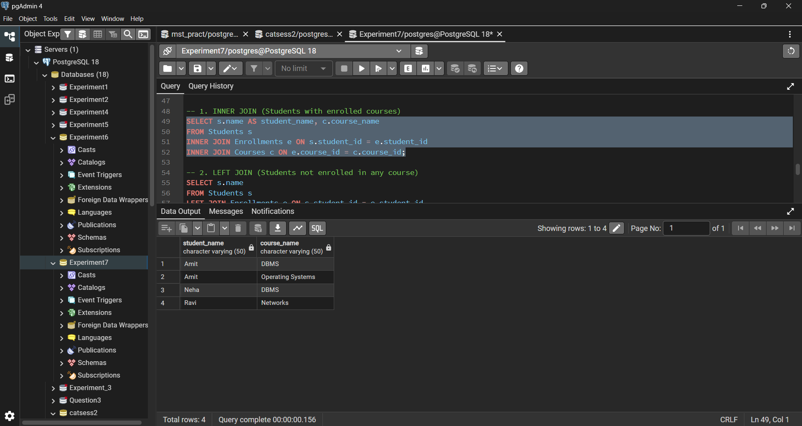
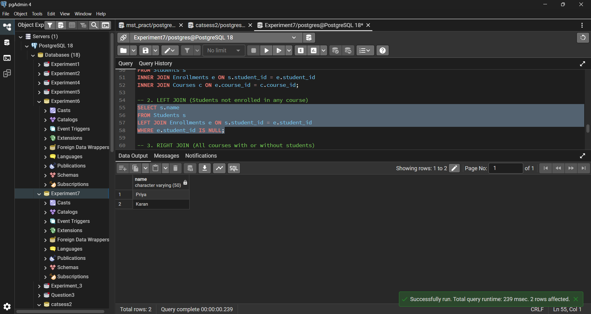
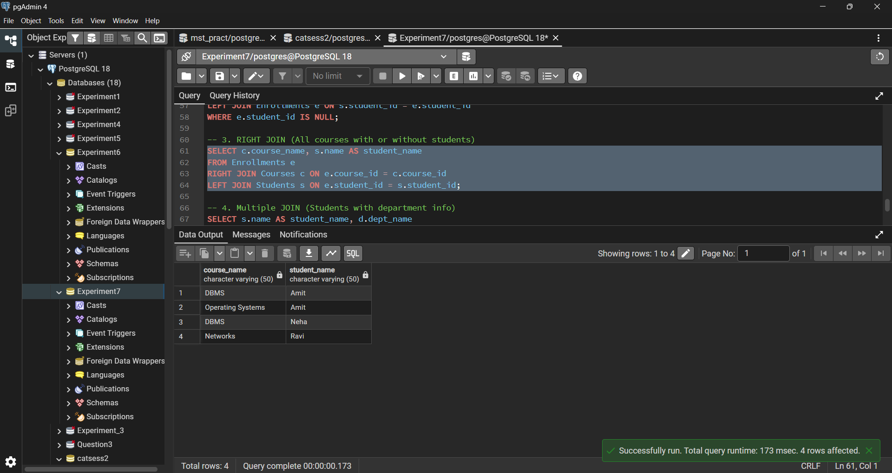
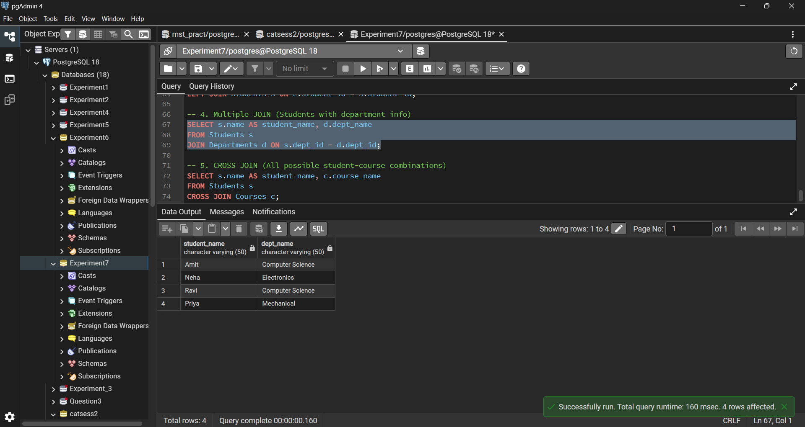
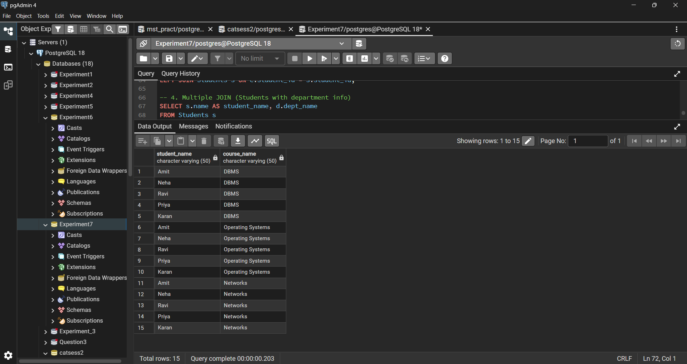

# Experiment 7

---

## Student Details

- **Student Name:** Sanchit Katoch 
- **UID:** 25MCA20059  
- **Branch:** MCA (GEN)  
- **Section/Group:** 25MCA-1_A  
- **Semester:** 2nd  
- **Date of Performance:** 31/03/26  
- **Subject Name:** Technical Training–1  
- **Subject Code:** 25CAP-652  

---

## Aim

To study and implement different types of SQL JOIN operations (INNER JOIN, LEFT JOIN, RIGHT JOIN, CROSS JOIN, and SELF/MULTIPLE JOIN) for retrieving and analyzing related data from multiple tables.

---

## Objectives

-	To implement INNER JOIN to fetch matching records from multiple tables. 
-	To use LEFT JOIN to identify unmatched records (e.g., students not enrolled). 
-	To apply RIGHT JOIN to display all records from the right table with matching data. 
-	To demonstrate CROSS JOIN for generating all possible combinations. 
-	To use MULTIPLE JOIN / SELF JOIN concepts to retrieve hierarchical or related data (e.g., student–department). 

---

## Tools Used

- PostgreSQL  

---

## Procedure

### Step 1: 
-Create Students, Courses, and Enrollments tables with appropriate attributes and primary keys. 

###	Step 2: 
-Insert sample records into all tables ensuring meaningful relationships between 	students and courses. 

### Step 3: 
-Execute INNER and LEFT JOIN queries to retrieve matching and unmatched 	student data. 

### Step 4: 
-Apply RIGHT JOIN and MULTIPLE JOIN to display courses and department 	information. 

### Step 5: 
-Use CROSS JOIN and verify outputs to understand all possible combinations 	clearly.

---

## Code

### Table Creation

```sql

CREATE TABLE Departments (
    dept_id INT PRIMARY KEY,
    dept_name VARCHAR(50)
);

CREATE TABLE Students (
    student_id INT PRIMARY KEY,
    name VARCHAR(50),
    dept_id INT,
    FOREIGN KEY (dept_id) REFERENCES Departments(dept_id)
);

CREATE TABLE Courses (
    course_id INT PRIMARY KEY,
    course_name VARCHAR(50)
);

CREATE TABLE Enrollments (
    student_id INT,
    course_id INT,
    FOREIGN KEY (student_id) REFERENCES Students(student_id),
    FOREIGN KEY (course_id) REFERENCES Courses(course_id)
);

```

### Insert Query

```sql

INSERT INTO Departments VALUES (1, 'Computer Science');
INSERT INTO Departments VALUES (2, 'Electronics');
INSERT INTO Departments VALUES (3, 'Mechanical');

INSERT INTO Students VALUES (101, 'Amit', 1);
INSERT INTO Students VALUES (102, 'Neha', 2);
INSERT INTO Students VALUES (103, 'Ravi', 1);
INSERT INTO Students VALUES (104, 'Priya', 3);
INSERT INTO Students VALUES (105, 'Karan', NULL);

INSERT INTO Courses VALUES (201, 'DBMS');
INSERT INTO Courses VALUES (202, 'Operating Systems');
INSERT INTO Courses VALUES (203, 'Networks');

INSERT INTO Enrollments VALUES (101, 201);
INSERT INTO Enrollments VALUES (101, 202);
INSERT INTO Enrollments VALUES (102, 201);
INSERT INTO Enrollments VALUES (103, 203);

```

```sql
-- 1. INNER JOIN (Students with enrolled courses)
SELECT s.name AS student_name, c.course_name
FROM Students s
INNER JOIN Enrollments e ON s.student_id = e.student_id
INNER JOIN Courses c ON e.course_id = c.course_id;

-- 2. LEFT JOIN (Students not enrolled in any course)
SELECT s.name
FROM Students s
LEFT JOIN Enrollments e ON s.student_id = e.student_id
WHERE e.student_id IS NULL;

-- 3. RIGHT JOIN (All courses with or without students)
SELECT c.course_name, s.name AS student_name
FROM Enrollments e
RIGHT JOIN Courses c ON e.course_id = c.course_id
LEFT JOIN Students s ON e.student_id = s.student_id;

-- 4. Multiple JOIN (Students with department info)
SELECT s.name AS student_name, d.dept_name
FROM Students s
JOIN Departments d ON s.dept_id = d.dept_id;

-- 5. CROSS JOIN (All possible student-course combinations)
SELECT s.name AS student_name, c.course_name
FROM Students s
CROSS JOIN Courses c;
```
---
## Output Screenshots

### Inner Join

### Left Join

### Right Join

### Multiple Join

### Cross Join


---

## Learning Outcomes

-	Differentiate between INNER, LEFT, RIGHT, and CROSS JOIN operations. 
-	Write SQL queries to retrieve data from multiple related tables efficiently. 
-	Identify and handle matched and unmatched records using different JOIN types. 
-	Apply SQL JOINs to solve real-world problems like student-course enrollment. 
-	Gain hands-on experience in designing and querying relational database structures.

---
